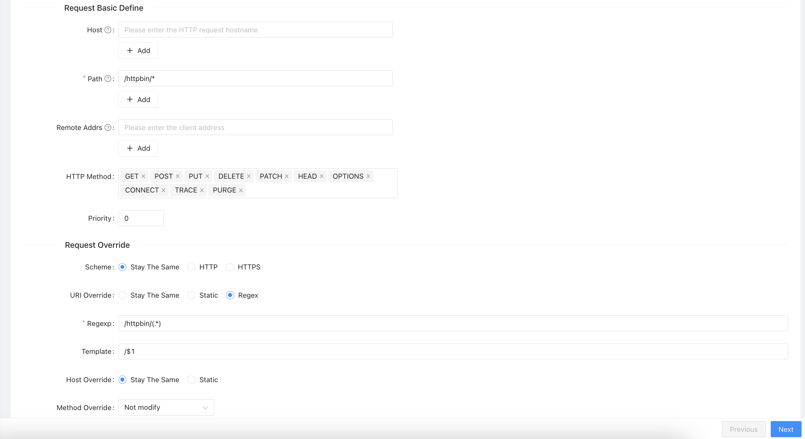

# APISIX Playground

## Requirements

- Docker
- Docker Compose
- ACD
  ```shell
  $ curl -sL "https://run.api7.ai/adc/install" | sh
  ```

## Getting started

1. **Start the Services**

Run the project:

```shell
$ docker compose up
```

This will start:

- `etcd` Key-Value store used by APISX
- `apisix` The API Gateway
- `apisix-dashboard:` Web UI to manage APISIX
- `httpbin` Sample HTTP service
- `redis` Used for rate limiting with persistence
- `prometheus` Used for metrics collection
- `grafana` Used for testing metrics-based dashboard

➡️ Access the dashboard at: http://localhost:9000 (admin/admin)

2. **Export your API Admin key**

Find the Admin API key in `api.config.yaml` under `deployment.admin.admin_key`, and export it:

```shell
export ADMIN_KEY=adminkey
```

## Configure Upstream and Route

### Enable necessary plugins

In your APISIX config (`api.config.yaml`), enable the following plugins:

```yaml
plugins:
  - proxy-rewrite
```

### Create Upstream and Route

We’ll start by routing requests to the `httpbin` upstream.

**Via UI**





**Via Admin API**

```shell
$ curl http://127.0.0.1:9180/apisix/admin/routes/1 -H "X-API-KEY: $ADMIN_KEY" -X PUT -i -d '
{
    "name": "httpbin-route",
    "uri": "/httpbin/*",
    "upstream": {
        "type": "roundrobin",
        "nodes": {
            "httpbin:80": 1
        }
    },
    "plugins": {
        "proxy-rewrite": {
            "regex_uri": ["/httpbin/(.*)", "/$1"]
        }
    }
}'
```

**Via ACD**

_To Be Defined_

**Testing**

Test the Route

```shell
$ curl http://localhost:9080/httpbin/ip  -i
HTTP/1.1 200 OK
{ "origin": "192.168.65.1" }
```

## API Key Auth + Rate Limiting

We’ll now enable API key-based authentication and configure rate limits based on consumer groups: `basic` and `premium`.

We will be using the following plugins

- `key-auth`: https://apisix.apache.org/docs/apisix/plugins/key-auth/
- `limit-req`: https://apisix.apache.org/docs/apisix/plugins/limit-req/

### Enable necessary plugins

In your APISIX config (`api.config.yaml`), enable the following plugins:

```yaml
plugins:
  - ...
  - limit-req
  - key-auth
```

### Create Consumer Groups

First we create Consumer Groups for each plan (basic and premium) using the plugin `limit-req`

**Via UI**

Not possible

**Via Admin API**

We'll define two plans with different rate limits:

Basic Plan (1 request/second)

```shell
$ curl http://127.0.0.1:9180/apisix/admin/consumer_groups/basic_plan -H "X-API-KEY: $ADMIN_KEY" -X PUT -d '
{
    "plugins": {
        "limit-req": {
            "rate": 1, # max request per second
            "burst": 0,
            "key": "consumer_name",  # restrict by consumer/api-key
            "rejected_code": 429
        }
    }
}'
```

Premium Plan (10 requests/second)

```shell
$ curl http://127.0.0.1:9180/apisix/admin/consumer_groups/premium_plan -H "X-API-KEY: $ADMIN_KEY" -X PUT -d '
{
    "plugins": {
        "limit-req": {
            "rate": 10, # max request per second
            "burst": 0,
            "key": "consumer_name", # restrict by consumer/api-key
            "rejected_code": 429
        }
    }
}'
```

**Via ACD**

_To Be Defined_

### Create Consumers

Let's create two consumers, one for each consumer group/plan leveraging `key-auth` plugin

**Via UI**

Not possible with plugins/group_id

**Via Admin API**

```shell
$ curl http://127.0.0.1:9180/apisix/admin/consumers -H "X-API-KEY: $ADMIN_KEY" -X PUT -d '
{
    "username": "consumer1",
    "plugins": {
        "key-auth": {
            "key": "apikey1"
        }
    },
    "group_id": "basic_plan"
}'
```

```shell
$ curl http://127.0.0.1:9180/apisix/admin/consumers -H "X-API-KEY: $ADMIN_KEY" -X PUT -d '
{
    "username": "consumer2",
    "plugins": {
        "key-auth": {
            "key": "apikey2"
        }
    },
    "group_id": "premium_plan"
}'
```

**Via ACD**

_To Be Defined_

### Configure the Global rules

Finally, let's configure `key-auth` globally with a global rule:

```shell
$ curl http://127.0.0.1:9180/apisix/admin/global_rules/1 -H "X-API-KEY: $ADMIN_KEY" -X PUT -i -d '
   {
        "plugins": {
            "key-auth": {}
        }
    }'
```

**Testing**

Try reaching out the service through the API Gateway

```shell
$ curl http://localhost:9080/httpbin/ip  -i
HTTP/1.1 401 Unauthorized
{"message":"Missing API key in request"}
```

```shell
$ curl http://localhost:9080/httpbin/ip  -i -H 'apikey: apikey1'
HTTP/1.1 200 OK
{"origin": "192.168.65.1"}
```

```shell
$ curl http://localhost:9080/httpbin/ip  -i -H 'apikey: apikey1'
HTTP/1.1 429 Too Many Requests
<html>
<head><title>429 Too Many Requests</title></head>
<body>
<center><h1>429 Too Many Requests</h1></center>
<hr><center>openresty</center>
<p><em>Powered by <a href="https://apisix.apache.org/">APISIX</a>.</em></p></body>
</html>
```

## Configure API Authentication with Long-Lived Rate Limits

We'll now enforce monthly quotas using `limit-count` (https://apisix.apache.org/docs/apisix/plugins/limit-count/)

### Enable necessary plugins

In your APISIX config (`api.config.yaml`), enable the following plugins:

```yaml
plugins:
  - ...
  - limit-count
```

### Update your Consumer Groups

**Via UI**

Not possible

**Via Admin API**

Update the **Basic Plan** to 10 requests per month:

```shell
$ curl http://127.0.0.1:9180/apisix/admin/consumer_groups/basic_plan -H "X-API-KEY: $ADMIN_KEY" -X PUT -d '
{
    "plugins": {
        "limit-req": {
            "rate": 1,
            "burst": 0,
            "key": "consumer_name",
            "rejected_code": 429
        },
        "limit-count": {
            "count": 10,
            "time_window": 2592000, # 1 month
            "key": "consumer_name", # restrict by consumer/api-key
            "policy": "redis",
            "redis_host": "redis",
            "redis_port": 6379,
            "rejected_code": 429
        }
    }
}'
```

Update the **Premium Plan** limited to 10000 request per month

```shell
$ curl http://127.0.0.1:9180/apisix/admin/consumer_groups/premium_plan -H "X-API-KEY: $ADMIN_KEY" -X PUT -d '
{
    "plugins": {
        "limit-req": {
            "rate": 10,             // 10 request per second
            "burst": 0,
            "key": "consumer_name", // restricted by consumer/api-key
            "rejected_code": 429
        },
        "limit-count": {
            "count": 10000,         // 10k request
            "time_window": 2592000, // per month
            "key": "consumer_name", // restricted by consumer/api-key
            "policy": "redis",
            "redis_host": "redis",
            "redis_port": 6379,
            "rejected_code": 429
      }
    }
}'
```

**Via ACD**

_To Be Defined_

**Testing**
Try out to reach the service through the API Gateway

```shell
$ curl http://localhost:9080/httpbin/ip  -i -H 'apikey: apikey1'
HTTP/1.1 200 OK
{"origin": "192.168.65.1"}
```

After exceeding monthly quota (x10):

```shell
$ curl http://localhost:9080/httpbin/ip  -i -H 'apikey: apikey1'
HTTP/1.1 429 Too Many Requests
<html>
<head><title>429 Too Many Requests</title></head>
<body>
<center><h1>429 Too Many Requests</h1></center>
<hr><center>openresty</center>
<p><em>Powered by <a href="https://apisix.apache.org/">APISIX</a>.</em></p></body>
</html>
```

## Metrics

This section helps you enable Prometheus monitoring in APISIX and configure it to scrape metrics every 10 seconds.

### Enable Prometheus Plugin in APISIX

In your `apisix/config.yaml`, make sure the following plugins are enabled and configured:

```yaml
## api.config.yaml
plugins:
  - ...
  - prometheus

plugin_attr:
  prometheus:
    export_uri: /apisix/prometheus/metrics # Set the URI for the Prometheus metrics endpoint.
    metric_prefix: apisix_ # Set the prefix for Prometheus metrics generated by APISIX.
    enable_export_server: true # Enable the Prometheus export server.
    export_addr: # Set the address for the Prometheus export server.
      ip: 0.0.0.0 # Set the IP.
      port: 9091
```

### Configure Prometheus

Update your `prometheus.yml` to scrape APISIX metrics every 10 seconds:

```yaml
## prometheus.yml
global:
  scrape_interval: 10s

scrape_configs:
  - job_name: "apisix"
    metrics_path: "/apisix/prometheus/metrics"
    static_configs:
      - targets: ["apisix:9091"]
```

### Update the Global Rule

Finally, update our global rule to enable the Prometheus plugin:

```shell
$ curl http://127.0.0.1:9180/apisix/admin/global_rules/1 -H "X-API-KEY: $ADMIN_KEY" -X PUT -i -d '
   {
        "plugins": {
            "key-auth": {},
            "prometheus": {}
        }
    }'
```

### Result

**Open Prometheus UI at: http://localhost:9090/targets**

Confirm that APISIX metrics are being scraped successfully.


**Visit the metrics endpoint directly**
http://127.0.0.1:9091/apisix/prometheus/metrics

```
# HELP apisix_bandwidth Total bandwidth in bytes consumed per service in APISIX
# TYPE apisix_bandwidth counter
apisix_bandwidth{type="ingress",route="1",...} 1352
apisix_bandwidth{type="egress",route="1",...} 4433
...
# HELP apisix_http_latency HTTP request latency in milliseconds
# TYPE apisix_http_latency histogram
apisix_http_latency_bucket{type="request",route="1",...} 13
...
```

### Configure Grafana

Examples of queries:

- Total successful requests

```promql
round(
  sum(
    increase(apisix_http_status
      {consumer="$consumer", code="200", request_uri!=""}
      [$__range]
    )
  )
)
```

- Total successful requests per endpoint

```promql
round(
  sum by (request_uri) (
    increase(apisix_http_status
      {consumer="$consumer", code="200", request_uri!=""}
      [$__range])
  )
)
```

- Total requests per status

```promql
round(
  sum by (code) (
    increase(apisix_http_status
      {consumer="$consumer", request_uri!=""}
      [$__range])
  )
)
```


